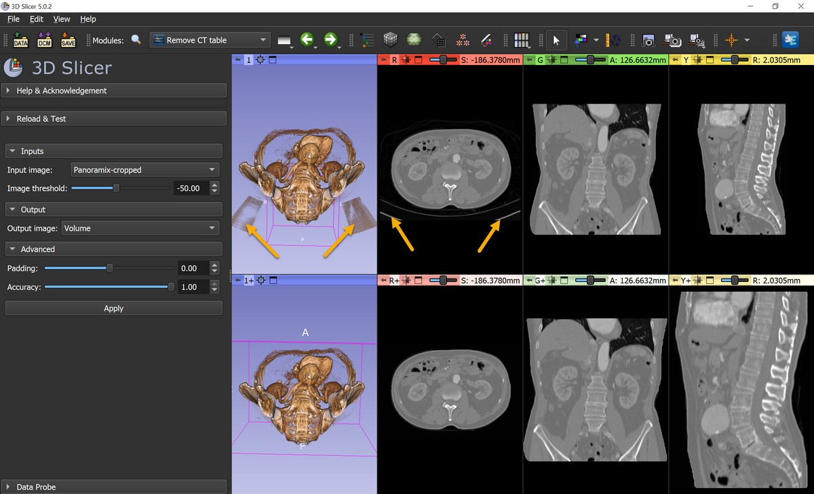
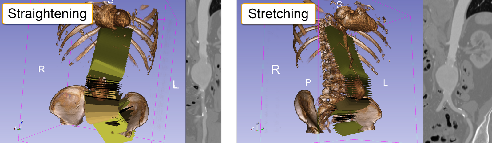
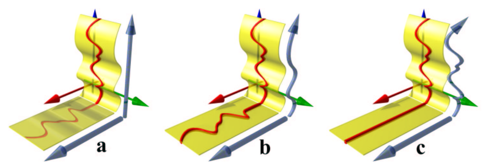
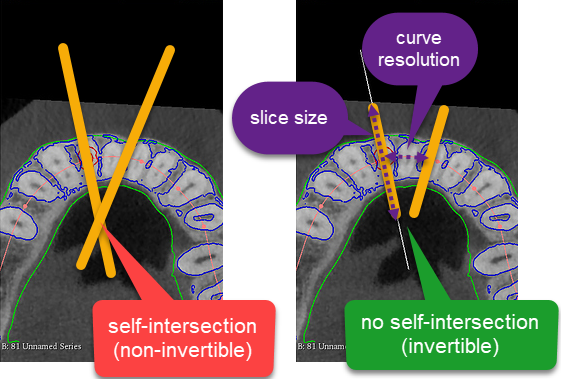
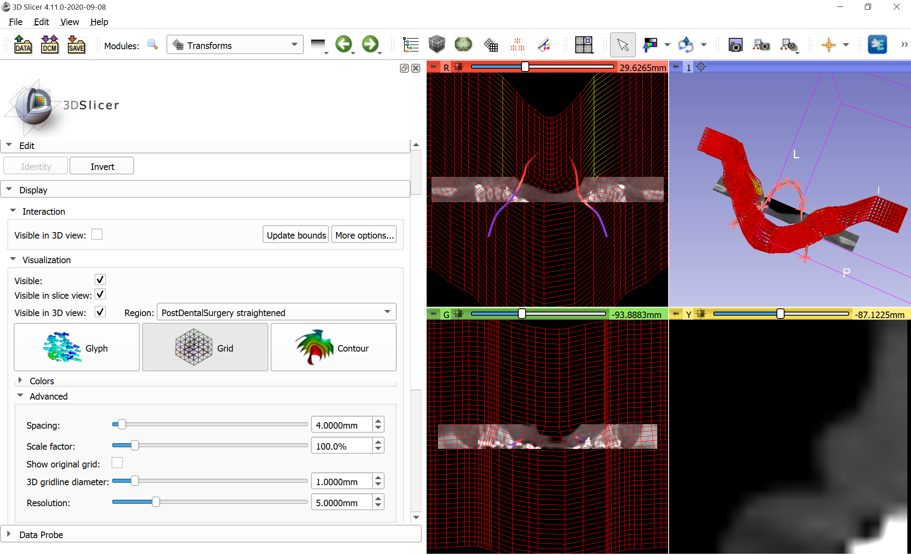
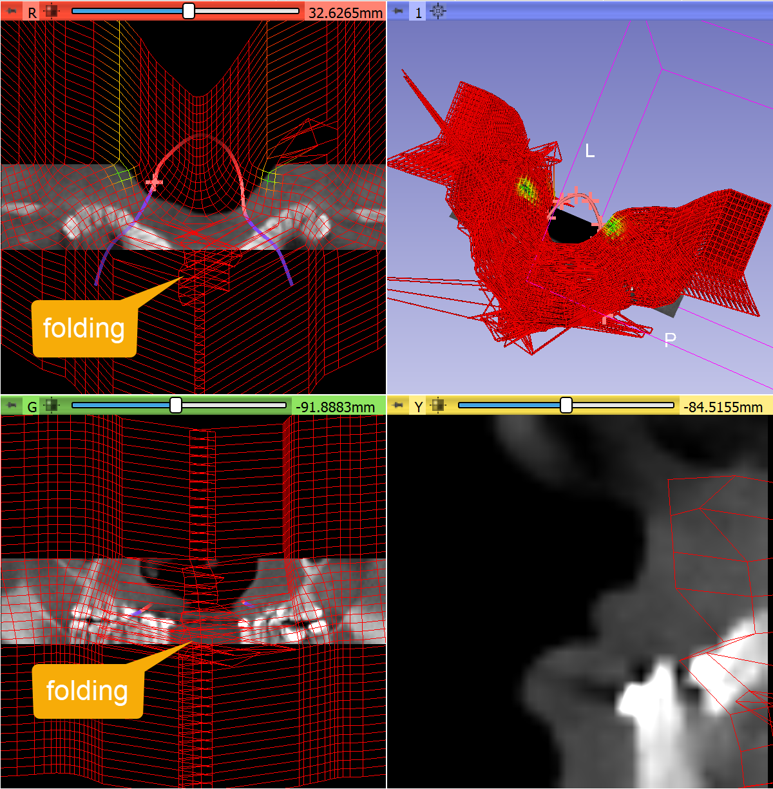

# SlicerSandbox


Collection of modules for 3D Slicer, which are already useful, but not finalized, polished, or proven to be useful enough to be included in Slicer core.
- Auto Save: automatically save the scene at specified time intervals.
- [Characterize Transform Matrix](#characterize-transform-matrix): quick geometric interpretations of a transformation matrix
- Combine Models: Boolean operations(union, intersection, difference) for models.
- [Curved Planar Reformat](#curved-planar-reformat): straighten vessels, bones, or other structures for easier visualization, quantification, creating panoramic dental X-ray, etc.
- Documentation Tools: tools for creating documentation on read-the-docs. It can generate html documentation from a Slicer source tree, convert module documentation from MediaWiki to markdown, etc.
- [Import ITK-Snap label description file](#ImportItkSnapLabel): import label description (*.label, *.txt) files as a color table node
- Import OCT: Load Topcon OCT image file (`*.fda`).
- Import Osirix ROI: Load Osirix ROI files as segmentation.
- Import SliceOmatic: Load SliceOmatic segmentation files.
- [Lights](#lights): customize lighting in 3D views.
- Line Profile: compute and plot image intensity profile along a line.
- Scene Recorder: record all MRML node change events into a json document.
- Segment Cross-Section Area: Measure cross-section of a segmentation along one of its axis. Note there are more advanced tools for this now in [Segment Geometry](https://github.com/jmhuie/Slicer-SegmentGeometry) and [SlicerVMTK](https://github.com/vmtk/SlicerExtension-VMTK#the-vmtk-extension-for-3d-slicer) extensions.
- [Stitch Volumes](#stitch-volumes): stitch together image volumes which share physical coordinate systems (e.g. CT scans with different stations)
- Style Tester: test Qt style sheet changes.
- User Statistics: collect statistics about what modules and tools are used and for how long.
- Volume Rendering Special Effects: custom shaders for special volume rendering effects.

## Lights

This module can be used to adjust lighting and rendering options in 3D views. Select all or specific 3D views at the top, then adjust options in sections below.

- Lighting: configures a [lightkit](https://vtk.org/doc/nightly/html/classvtkLightKit.html) that is used for rendering of all 3D content, including volume rendering. The kit consists of the key light (typically the strongest light, simulating overhead lighting, such as ceiling lights or sun), fill light (typically same side as key light, but other side; simulating diffuse reflection of key light), headlight (moves with the camera, reduces contrast between key light and fill light), back lights (fill on the high-contrast areas behind the object). [**Short demo video**](https://youtu.be/rQZ9enRbn0w)
- Ambient shadows: Uses screen space ambient occlusion (SSAO) method to simulate shadows. Size scale determines the details that are emphasized. The scale is logarithmic, the default 0 value corresponds to 100mm. For highlighting smaller details (such as uneven surface), reduce the value. Use larger values to make large objects better distinguishable. These settings have no effect on volume rendering.
- Image-based lighting: Necessary when models are displayed with PBR (physics based rendering) interpolation. Brightness of the image determines the amount of light reflected from object surfaces; and fragments of the image appears as reflection on surface of smooth metallic objects. Currently only a single picture is provided via the user interface ([hospital_room](https://github.com/PerkLab/SlicerSandbox/blob/master/Lights/Resources/hospital_room.jpg)), but other images can be downloaded (for example from [polyhaven.com](https://polyhaven.com)) and be used in the Python API of the module. These settings have no effect on volume rendering. See some examples [here](https://discourse.slicer.org/t/new-feature-basic-support-for-physically-based-rendering-pbr/21725).


## Remove CT table

Remove patient table from CT images fully automatically, by blanking out (filling with -1000 HU) voxels that are not included in an automatically determined convex-shaped region of interest.

If boundary of the extracted region is chipped away in the output image then either add a fixed-size `padding` and/or increase the computation `accuracy` (in `Advanced` section).



## Curved Planar Reformat

Curved planar reformat module allows "straightening" (default) or "stretching" a curved volume for visualization or quantification. The module provides two-way spatial mapping between the original and straightened space.



Difference between the two modes are nicely explained in the paper of [Kanitsar et al.](https://www.cg.tuwien.ac.at/research/vis/adapt/Vis2002/AKanitsar_CPR.pdf) (see in the image below: a = projection, b = stretching, c = straightening):

- Straightening: Fully straightens the tubular structure. This CPR method generates a linear representation of the vessel with varying diameter. The height of the resulting image corresponds to the length of the central axis.
- Stretching: The surface defined by the vessel central axis and the vector-of-interest is curved in one dimension and planar in the other one. As the distance between the two consecutive points is preserved by this operation in image space, isometry is maintained. This isometry is the main advantage of this mode compared to projected or straightened mode.



### Adjust reformatting parameters for robust mapping

If the slice size is too large or curve resolution is too fine then in some regions you can have transform that maps the same point into different positions (the displacement field folds into itself). In these regions the transforms in not invertible.

To reduce these ambiguously mapped regions, decrease `Slice size`. If necessary `Curve resolution` can be slightly increased as well (it controls how densely the curve is sampled to generate the displacement field, if samples are farther from each other then it may reduce chance of contradicting samples).



You can quickly validate the transform, by going to Transforms module and in Display/Visualization section check all 3 checkboxes, the straightened image as `Region` and visualization mode to `Grid`.

For example, this transform results in a smooth displacement field, it is invertible in the visualized region:



If the slice size is increased then folding occurs:



Probably you can find a parameter set that works for a large group of patients. Maybe one parameter set works for all, but maybe you need to have a few different presets (small, medium, large)

## Characterize Transform Matrix

It is often difficult to understand what a transform matrix is doing just by inspecting the numerical values.  All the information is in those 12 numbers, but not in an easily understood format. Characterize Transform Matrix module provides information on what a transformation matrix is doing.  For example, is it a rigid transformation or is there scaling or reflection?  If there is scaling, what are the scale factors and stretch directions?  Is there rotation?  If so, what is the axis of rotation and how much rotation occurs around that axis?  Alternatively, if we break down the rotation into a sequence of rotations around coordinate axes, what is the rotation about each axis?

### How to use
Open the module and select the transform node you want to know about.  An analysis such as the following will appear in the text box below:

```
This transformation does not include a reflection.
Scale factors and stretch directions (eigenvalues and eigenvectors of stretch matrix K):
  f0: +0.012% change in direction [1.00, 0.03, -0.08]
  f1: -2.843% change in direction [-0.08, -0.10, -0.99]
  f2: +3.248% change in direction [0.04, -0.99, 0.10]
This transform is not rigid! Total volume changes by +0.325%, and maximal change in one direction is +3.248%
The rotation matrix portion of this transformation rotates 15.0 degrees ccw (if you look in the direction the vector points) around a vector which points to [0.76, -0.59, -0.27] (RAS)
Broken down into a series of rotations around axes, the rotation matrix portion of the transformation rotates
  11.8 degrees ccw around the positive R axis, then
  8.4 degrees cw around the positive A axis, then
  5.0 degrees cw around the positive S axis
Lastly, this transformation translates, shifting:
  +194.2 mm in the R direction
  +73.4 mm in the A direction
  -1170.3 mm in the S direction
The order of application of the decomposed operations is stretch, then rotate, then translate. A different order of transform application would generally lead to a different set of decomposition matrices.
```
This analysis is for the matrix
```
0.985821 0.0570188 -0.157817 194.155
-0.0873217 1.01 -0.192319 73.4412
0.14329 0.203373 0.94 -1170.25
0 0 0 1
```
### Some Decomposition Details
This module uses polar decomposition to describe the components of a 4x4 transform matrix. The decomposition has the form: `H = T * F * R * K`, where `H` is the full homogeneous transformation matrix (with 0,0,0,1 as the bottom row), `T` is a translation-only matrix, `F` is a reflection-only matrix, `R` is a rotation-only matrix, and `K` is a stretch matrix. `K` can further be decomposed into three scale matrices, which can each be characterized by a stretch direction (an eigenvector) and a stretch factor (the associated eigenvalue). Points to be transformed are on the right, so the order of operations is stretching first, then rotation, then reflection, then translation.

If you would like access to the decomposed components of the matrix, you can call the relevant logic function of this module as follows:
```
import CharacterizeTransformMatrix
decompositionResults = CharacterizeTransformMatrix.CharacterizeTransformMatrixLogic().characterizeLinearTransformNode(transformNode)
```
`decompositionResults` will then be a namedTuple with all the information from the decomposition. For example, `decompositionResults.rotationAngleDegrees` will have the angle the transformation rotates by around the rotation axis.  The named fields of the results are

|Field Name| Description|
| ----------- | ----------- |
| textResults | a line by line list of the analysis text |
| isRigid | boolean, true if largest strech % change is less that 0.1% and if there is no reflection |
| hasReflection | boolean, true if there is reflection |
| scaleFactors | numpy vector of scale factors in eigendirections of stretch matrix (with a 4th element which is always 1) |
|scaleDirections| list of 3 scale directions as 4 element vectors (4th element always 0)|
|largestPercentChangeScale | largest scale factor as a percent change (100 * (scaleFactor-1)) |
|volumePercentChangeOverall| total volume % change after all stretching/shrinking|
|scipyRotationObject| scipy `Rotation` object of the rotation component of the transform|
|rotationAxis | RAS vector describing the axis the transform rotates about|
|rotationAngleDegrees| positive if counterclockwise when looking down axis|
|eulerAnglesRAS | sequence of rotation angles about the Right, Anterior, and then Superior axes|
|translationVector| 3-element vector of RAS translation|
|translationOnlyMatrix| identitiy matrix with translation vector in 4th column|
|rotationOnlyMatrix|4x4 rotation matrix `R` from the decomposition|
|reflectionOnlyMatrix|4x4 reflection matrix `F` from the decomposition. This is the identity matrix if there is no reflection, and is `np.diag([-1,-1,-1,1])` if reflection is present|
|stretchOnlyMatrix|4x4 stretch matrix `K` from the decomposition|
|scaleMatrixList|list of three 4x4 symmetric (likely non-uniform) scale matrices (`S1*S2*S3=K`)|
|stretchEigenvectorMatrix|4x4 matrix with the stretch direction eigenvectors as the first 3 columns|

## Stitch Volumes

This module allows a user to stitch together two or more image volumes. A set of volumes to stitch, as well as a rectangular ROI (to define the output geometry) is supplied, and this module produces an output volume which represents all the input volumes cropped, resampled, and stitched together. Areas of overlap between original volumes are handled by finding the center of the overlap region, and assigning each half of the overlap to the closer original volume.

The resolution (voxel dimensions) of the output stitched volume is set to match the first input image. If other image volumes are at the same resolution, the stitched volume uses nearest-neighbor interpolation in order to avoid any image degradation due to interpolation, but please note that this could mean that there is a physical space shift of up to 1/2 voxel in each dimension for the positioning of one original volume compared to where it appears in the stitched volume's physical space. If original volumes are not at the same voxel resolution, then interpolation is definitely required, and linear interpolation is used. Voxels in the stitched image which are outside all original image volumes are assigned a voxel value of zero.


### How to use

The input image volumes must already be positioned in their correct location. Fiducial Registration Wizard module in SlicerIGT extension can be used for moving the images to correct location, based on matching langmarks.

A region of interest (ROI) markup needs to be defined to designate the region that the stitched volume should fill. This is typically done in two steps:
- Go to `Crop Volumes` module, select first volume to stitch as input volume, select `Create new ROI` as ROI, and then click `Fit to Volume`. This creates an ROI which is oriented the same way and with the same dimensions as the input volume. (The volume is not cropped, Crop Volumes module is used just because of the handy `Fit to Volume` button).
- Next, extend the ROI as needed to encompass the desired regions of all image volumes to stitch using the interaction handles in the slice views or in 3D.

This ROI definition works well if connecting a series of image volumes along one axis (e.g., a series of bed positions) and it works well to mostly extend an ROI in one direction (and often also bring in the sides to reduce the number of air voxels), but a rectilinear ROI can be created any other way.

Once the ROI is created, go to the `Stitch Volumes` module, select the image volumes to be stitched together, select the ROI, select or create the output to put the stitched volume in, and click the `Create Stitched Volume` button. The selected output will be a new image volume with the same orientation and extent as the ROI, with the same voxel size as the first image volume listed to stitch.

## ImportItkSnapLabel

This module registers a file reader for label description files (`*.label`, `*.txt`, see [example](https://github.com/PerkLab/SlicerSandbox/blob/master/ImportItkSnapLabel/Resources/Untitled.label)) created by ITK-Snap. The reader creates a color table node that can be used for loading labelmap volume or segmentation files (`*.nrrd`, `*.nii.gz`, etc.).

How to use:
- Load the `*.label` or `*.txt` file as a color table node:
  - Drag-and-drop the label description file over the Slicer main window (or choose `Add Data` in the `File` menu and choose the file to add)
  - Make sure that in the description column `ITK-Snap Label Description` is selected
  - Click OK
- Load the image or segmentation `*.nii.gz` or `*.nrrd` file
  - Drag-and-drop the image file over the Slicer main window (or choose `Add Data` in the `File` menu and choose the file to add)
  - Check `Show Options` checkbox
  - Make sure that in the description column `Segmentation` is selected (or `Volume` is selected and `Label` checkbox is checked)
  - Choose the loaded color table node in the options column (rightmost widget)
  - Click OK


## ImportNumpyArray

This module registers a file reader for numpy array (`.npy`, `.npz`).

See https://numpy.org/devdocs/reference/generated/numpy.lib.format.html#npy-format

The reader can read an array of 1 to 5 dimensions into an image represented by a specific MRML node.

| Dimension | Axis order                         | MRML node                 |
|-----------|------------------------------------|---------------------------|
| 1D        | `I`                                | `vtkMRMLScalarVolumeNode` |
| 2D        | `J`, `I`                           | `vtkMRMLScalarVolumeNode` |
| 3D        | `K`, `J`, `I`                      | `vtkMRMLScalarVolumeNode` |
| 4D        | `K`, `J`, `I`, `component`         | `vtkMRMLVectorVolumeNode` |
| 5D        | `time`, `K`, `J`, `I`, `component` | `vtkMRMLSequenceNode`     |


Notes:

* User is responsible for setting the correct IJK to RAS matrix.

* For the 4D and 5D cases, having the channel-last convention corresponds to the ITK/VTK memory layout and is different from the
  convention used in `PyTorch` for [NCHW for 4D][NCHW] tensors/arrays and [NCDHW for 5D][NCDHW].

[NCHW]: https://pytorch.org/docs/stable/generated/torch.nn.Conv2d.html#torch.nn.Conv2d
[NCDHW]: https://pytorch.org/docs/stable/generated/torch.nn.Conv3d.html#torch.nn.Conv3d


## LoadRemoteFile

Example module that allows opening a file in 3D Slicer by clicking on a link in a web browser. It requires the `slicer://` custom URL protocol to be associated with the 3D Slicer application. The Slicer installer on Windows does this automatically, but it has to be set up manually on linux and macOS.

Example links that open image and/or segmentation in 3D Slicer:
- LungCTAnalyzerChestCT image: `slicer://viewer/?download=https%3A%2F%2Fgithub.com%2Frbumm%2FSlicerLungCTAnalyzer%2Freleases%2Fdownload%2FSampleData%2FLungCTAnalyzerChestCT.nrrd`
- LungCTAnalyzerChestCT image + segmentation" `slicer://viewer/?show3d=true&segmentation=https%3A%2F%2Fgithub.com%2Frbumm%2FSlicerLungCTAnalyzer%2Freleases%2Fdownload%2FSampleData%2FLungCTAnalyzerMaskSegmentation.seg.nrrd&image=https%3A%2F%2Fgithub.com%2Frbumm%2FSlicerLungCTAnalyzer%2Freleases%2Fdownload%2FSampleData%2FLungCTAnalyzerChestCT.nrrd`
